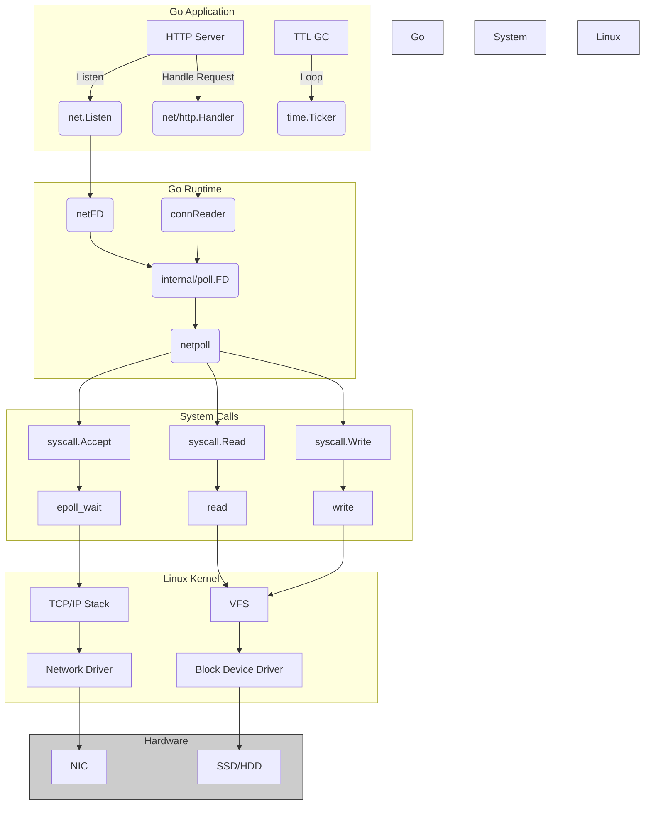
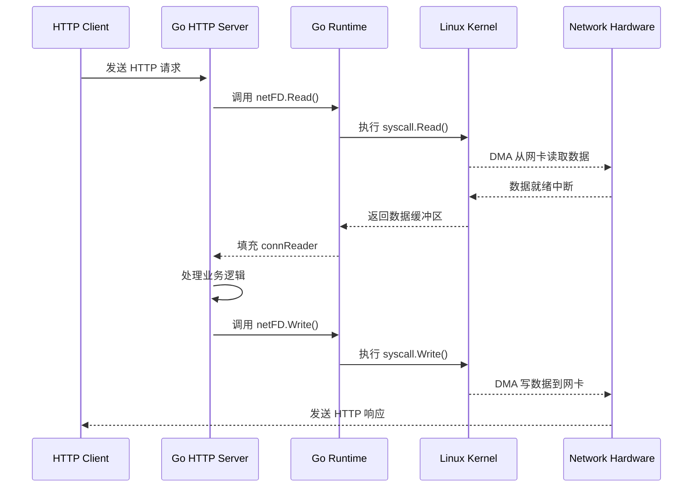

以下是 Go 程序与 Linux 内核交互的模块关系图（使用 Mermaid 语法）：



### 关键交互流程说明：
1. **HTTP Server 启动**：
   ```go
   net.Listen("tcp", ":8080") 
   → 创建 netFD (网络文件描述符)
   → 调用 syscall.Socket()
   → 内核创建 socket 结构体
   ```

2. **请求接收**：
   ```go
   listener.Accept()
   → internal/poll.FD.Accept()
   → syscall.Accept4()
   → 内核 TCP/IP 协议栈处理三次握手
   ```

3. **数据读取**：
   ```go
   conn.Read()
   → connReader.backgroundRead()
   → syscall.Read()
   → 内核 VFS 层通过 DMA 从网卡读取数据
   ```

4. **I/O 多路复用**：
   ```go
   runtime.netpoll()
   → 使用 epoll_wait 系统调用
   → 内核监控就绪的 fd 集合
   → 通过 eventfd 通知用户空间
   ```

5. **定时器交互**：
   ```go
   time.Ticker(1*time.Hour)
   → 调用 timerfd_create
   → 内核通过 hrtimer 高精度定时器
   → 超时后通过 epoll 通知
   ```

### 详细模块交互矩阵：
| Go 层组件            | 系统调用                  | 内核子系统       | 硬件交互        |
|----------------------|--------------------------|------------------|----------------|
| net/http.Server      | accept4()                | TCP/IP 协议栈    | 网卡 (NIC)     |
| internal/poll.FD     | epoll_wait()             | 事件通知机制     | 中断控制器      |
| os.File.Read         | read()                   | VFS 文件系统     | 块存储设备      |
| time.Ticker          | timerfd_settime()        | hrtimer 子系统   | HPET/ACPI PM   |
| runtime.netpoll      | epoll_ctl()              | 进程调度器       | CPU 时间片管理 |

### 典型数据流示例（HTTP 请求处理）：


这个交互图展示了 Go 程序通过以下关键路径与 Linux 内核协作：
1. 使用 **epoll 多路复用**实现高并发 I/O
2. 通过 **DMA 直接内存访问**减少 CPU 拷贝开销
3. 利用 **timerfd** 实现精确的定时器管理
4. 依赖 **VFS 抽象层**统一处理不同文件系统
