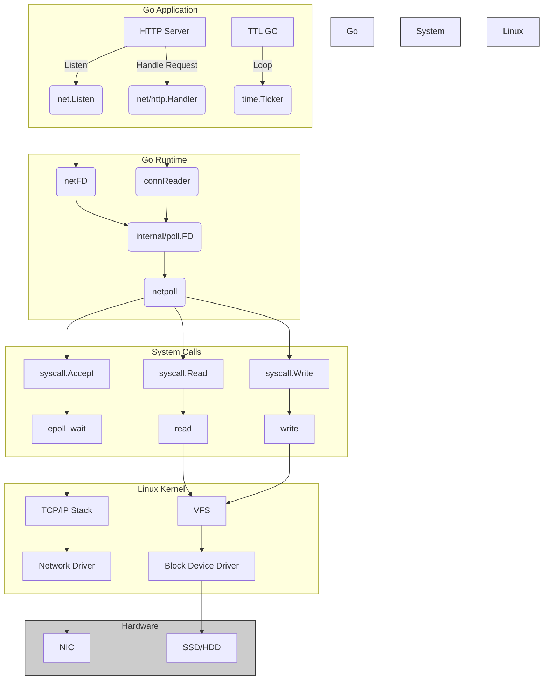
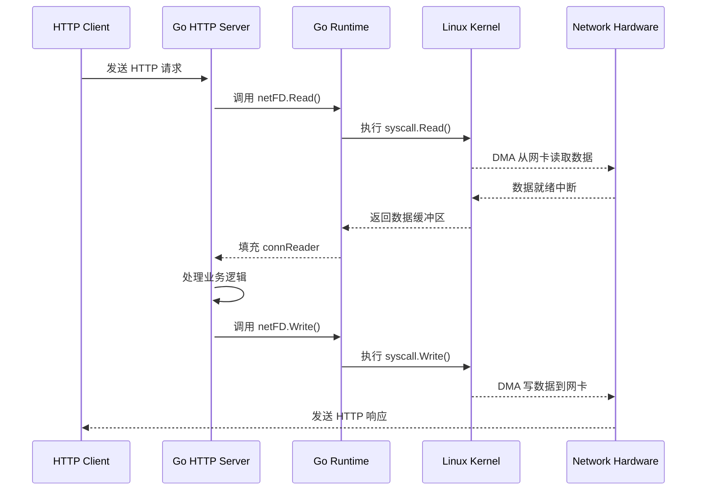

```plaintext
goroutine profile: total 5
1 @ 0x43a971 0x478c3d 0x736171 0x735fa5 0x732dcb 0x74c60f 0x74d0be 0x6c02a9 0x6c21a4 0x6cdb0e 0x6be7a5 0x481801
#	0x736170	runtime/pprof.writeRuntimeProfile+0xb0	/usr/local/go/src/runtime/pprof/pprof.go:796
#	0x735fa4	runtime/pprof.writeGoroutine+0x44	/usr/local/go/src/runtime/pprof/pprof.go:755
#	0x732dca	runtime/pprof.(*Profile).WriteTo+0x14a	/usr/local/go/src/runtime/pprof/pprof.go:377
#	0x74c60e	net/http/pprof.handler.ServeHTTP+0x52e	/usr/local/go/src/net/http/pprof/pprof.go:272
#	0x74d0bd	net/http/pprof.Index+0xdd		/usr/local/go/src/net/http/pprof/pprof.go:389
#	0x6c02a8	net/http.HandlerFunc.ServeHTTP+0x28	/usr/local/go/src/net/http/server.go:2294
#	0x6c21a3	net/http.(*ServeMux).ServeHTTP+0x1c3	/usr/local/go/src/net/http/server.go:2822
#	0x6cdb0d	net/http.serverHandler.ServeHTTP+0x8d	/usr/local/go/src/net/http/server.go:3301
#	0x6be7a4	net/http.(*conn).serve+0x624		/usr/local/go/src/net/http/server.go:2102

1 @ 0x479dce 0x413225 0x412dd2 0x7c2067 0x481801
#	0x7c2066	github.com/kay/kvstore/store.(*Store).StartTTLGC.func1+0xc6	/home/kay/codebase/test/book_cloud_naive_go/chap5/store/boltdb.go:262

1 @ 0x479dce 0x43de17 0x478fe5 0x4d8ae7 0x4ddeb5 0x4ddea3 0x598e29 0x5ac6bb 0x5ab8b0 0x6c3c8c 0x6c3891 0x7c4508 0x7c44b8 0x4453cb 0x481801
#	0x478fe4	internal/poll.runtime_pollWait+0x84		/usr/local/go/src/runtime/netpoll.go:351
#	0x4d8ae6	internal/poll.(*pollDesc).wait+0x26		/usr/local/go/src/internal/poll/fd_poll_runtime.go:84
#	0x4ddeb4	internal/poll.(*pollDesc).waitRead+0x294	/usr/local/go/src/internal/poll/fd_poll_runtime.go:89
#	0x4ddea2	internal/poll.(*FD).Accept+0x282		/usr/local/go/src/internal/poll/fd_unix.go:620
#	0x598e28	net.(*netFD).accept+0x28			/usr/local/go/src/net/fd_unix.go:172
#	0x5ac6ba	net.(*TCPListener).accept+0x1a			/usr/local/go/src/net/tcpsock_posix.go:159
#	0x5ab8af	net.(*TCPListener).Accept+0x2f			/usr/local/go/src/net/tcpsock.go:380
#	0x6c3c8b	net/http.(*Server).Serve+0x30b			/usr/local/go/src/net/http/server.go:3424
#	0x6c3890	net/http.(*Server).ListenAndServe+0x70		/usr/local/go/src/net/http/server.go:3350
#	0x7c4507	net/http.ListenAndServe+0x407			/usr/local/go/src/net/http/server.go:3665
#	0x7c44b7	main.main+0x3b7					/home/kay/codebase/test/book_cloud_naive_go/chap5/main.go:84
#	0x4453ca	runtime.main+0x28a				/usr/local/go/src/runtime/proc.go:283

1 @ 0x479dce 0x43de17 0x478fe5 0x4d8ae7 0x4ddeb5 0x4ddea3 0x598e29 0x5ac6bb 0x5ab8b0 0x6c3c8c 0x6c3891 0x7c4df6 0x7c4df7 0x481801
#	0x478fe4	internal/poll.runtime_pollWait+0x84		/usr/local/go/src/runtime/netpoll.go:351
#	0x4d8ae6	internal/poll.(*pollDesc).wait+0x26		/usr/local/go/src/internal/poll/fd_poll_runtime.go:84
#	0x4ddeb4	internal/poll.(*pollDesc).waitRead+0x294	/usr/local/go/src/internal/poll/fd_poll_runtime.go:89
#	0x4ddea2	internal/poll.(*FD).Accept+0x282		/usr/local/go/src/internal/poll/fd_unix.go:620
#	0x598e28	net.(*netFD).accept+0x28			/usr/local/go/src/net/fd_unix.go:172
#	0x5ac6ba	net.(*TCPListener).accept+0x1a			/usr/local/go/src/net/tcpsock_posix.go:159
#	0x5ab8af	net.(*TCPListener).Accept+0x2f			/usr/local/go/src/net/tcpsock.go:380
#	0x6c3c8b	net/http.(*Server).Serve+0x30b			/usr/local/go/src/net/http/server.go:3424
#	0x6c3890	net/http.(*Server).ListenAndServe+0x70		/usr/local/go/src/net/http/server.go:3350
#	0x7c4df5	net/http.ListenAndServe+0x135			/usr/local/go/src/net/http/server.go:3665
#	0x7c4df6	main.main.func3+0x136				/home/kay/codebase/test/book_cloud_naive_go/chap5/main.go:78

1 @ 0x499dc5 0x498478 0x4d9e0e 0x4d9df6 0x4d9c91 0x596e85 0x5a3745 0x6b8677 0x481801
#	0x499dc4	syscall.Syscall+0x24				/usr/local/go/src/syscall/syscall_linux.go:73
#	0x498477	syscall.read+0x37				/usr/local/go/src/syscall/zsyscall_linux_amd64.go:736
#	0x4d9e0d	syscall.Read+0x2ad				/usr/local/go/src/syscall/syscall_unix.go:183
#	0x4d9df5	internal/poll.ignoringEINTRIO+0x295		/usr/local/go/src/internal/poll/fd_unix.go:745
#	0x4d9c90	internal/poll.(*FD).Read+0x130			/usr/local/go/src/internal/poll/fd_unix.go:161
#	0x596e84	net.(*netFD).Read+0x24				/usr/local/go/src/net/fd_posix.go:55
#	0x5a3744	net.(*conn).Read+0x44				/usr/local/go/src/net/net.go:194
#	0x6b8676	net/http.(*connReader).backgroundRead+0x36	/usr/local/go/src/net/http/server.go:690

```


以下是 Go 程序与 Linux 内核交互的模块关系图（使用 Mermaid 语法）：



### 关键交互流程说明：
1. **HTTP Server 启动**：
   ```go
   net.Listen("tcp", ":8080") 
   → 创建 netFD (网络文件描述符)
   → 调用 syscall.Socket()
   → 内核创建 socket 结构体
   ```

2. **请求接收**：
   ```go
   listener.Accept()
   → internal/poll.FD.Accept()
   → syscall.Accept4()
   → 内核 TCP/IP 协议栈处理三次握手
   ```

3. **数据读取**：
   ```go
   conn.Read()
   → connReader.backgroundRead()
   → syscall.Read()
   → 内核 VFS 层通过 DMA 从网卡读取数据
   ```

4. **I/O 多路复用**：
   ```go
   runtime.netpoll()
   → 使用 epoll_wait 系统调用
   → 内核监控就绪的 fd 集合
   → 通过 eventfd 通知用户空间
   ```

5. **定时器交互**：
   ```go
   time.Ticker(1*time.Hour)
   → 调用 timerfd_create
   → 内核通过 hrtimer 高精度定时器
   → 超时后通过 epoll 通知
   ```

### 详细模块交互矩阵：
| Go 层组件            | 系统调用                  | 内核子系统       | 硬件交互        |
|----------------------|--------------------------|------------------|----------------|
| net/http.Server      | accept4()                | TCP/IP 协议栈    | 网卡 (NIC)     |
| internal/poll.FD     | epoll_wait()             | 事件通知机制     | 中断控制器      |
| os.File.Read         | read()                   | VFS 文件系统     | 块存储设备      |
| time.Ticker          | timerfd_settime()        | hrtimer 子系统   | HPET/ACPI PM   |
| runtime.netpoll      | epoll_ctl()              | 进程调度器       | CPU 时间片管理 |

### 典型数据流示例（HTTP 请求处理）：


这个交互图展示了 Go 程序通过以下关键路径与 Linux 内核协作：
1. 使用 **epoll 多路复用**实现高并发 I/O
2. 通过 **DMA 直接内存访问**减少 CPU 拷贝开销
3. 利用 **timerfd** 实现精确的定时器管理
4. 依赖 **VFS 抽象层**统一处理不同文件系统
