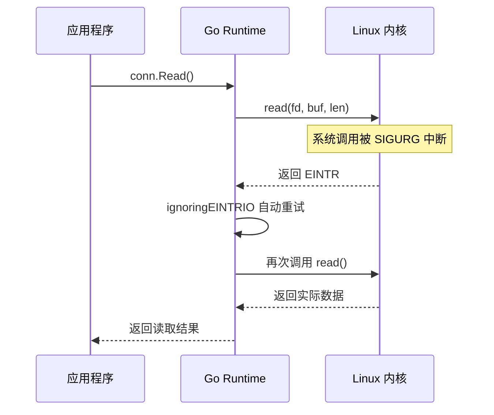
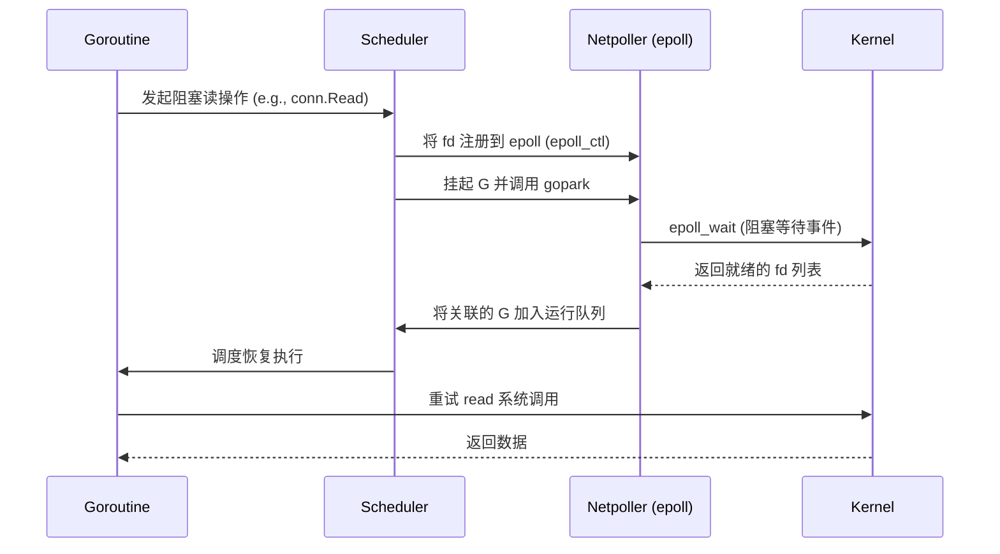

# **Go 程序与 Linux 内核交互的模块关系分析**

## **goroutine profile 堆栈**

```plaintext
goroutine profile: total 5
1 @ 0x43a971 0x478c3d 0x736171 0x735fa5 0x732dcb 0x74c60f 0x74d0be 0x6c02a9 0x6c21a4 0x6cdb0e 0x6be7a5 0x481801
#	0x736170	runtime/pprof.writeRuntimeProfile+0xb0	/usr/local/go/src/runtime/pprof/pprof.go:796
#	0x735fa4	runtime/pprof.writeGoroutine+0x44	/usr/local/go/src/runtime/pprof/pprof.go:755
#	0x732dca	runtime/pprof.(*Profile).WriteTo+0x14a	/usr/local/go/src/runtime/pprof/pprof.go:377
#	0x74c60e	net/http/pprof.handler.ServeHTTP+0x52e	/usr/local/go/src/net/http/pprof/pprof.go:272
#	0x74d0bd	net/http/pprof.Index+0xdd		/usr/local/go/src/net/http/pprof/pprof.go:389
#	0x6c02a8	net/http.HandlerFunc.ServeHTTP+0x28	/usr/local/go/src/net/http/server.go:2294
#	0x6c21a3	net/http.(*ServeMux).ServeHTTP+0x1c3	/usr/local/go/src/net/http/server.go:2822
#	0x6cdb0d	net/http.serverHandler.ServeHTTP+0x8d	/usr/local/go/src/net/http/server.go:3301
#	0x6be7a4	net/http.(*conn).serve+0x624		/usr/local/go/src/net/http/server.go:2102

1 @ 0x479dce 0x413225 0x412dd2 0x7c2067 0x481801
#	0x7c2066	github.com/kay/kvstore/store.(*Store).StartTTLGC.func1+0xc6	/home/kay/codebase/test/book_cloud_naive_go/chap5/store/boltdb.go:262

1 @ 0x479dce 0x43de17 0x478fe5 0x4d8ae7 0x4ddeb5 0x4ddea3 0x598e29 0x5ac6bb 0x5ab8b0 0x6c3c8c 0x6c3891 0x7c4508 0x7c44b8 0x4453cb 0x481801
#	0x478fe4	internal/poll.runtime_pollWait+0x84		/usr/local/go/src/runtime/netpoll.go:351
#	0x4d8ae6	internal/poll.(*pollDesc).wait+0x26		/usr/local/go/src/internal/poll/fd_poll_runtime.go:84
#	0x4ddeb4	internal/poll.(*pollDesc).waitRead+0x294	/usr/local/go/src/internal/poll/fd_poll_runtime.go:89
#	0x4ddea2	internal/poll.(*FD).Accept+0x282		/usr/local/go/src/internal/poll/fd_unix.go:620
#	0x598e28	net.(*netFD).accept+0x28			/usr/local/go/src/net/fd_unix.go:172
#	0x5ac6ba	net.(*TCPListener).accept+0x1a			/usr/local/go/src/net/tcpsock_posix.go:159
#	0x5ab8af	net.(*TCPListener).Accept+0x2f			/usr/local/go/src/net/tcpsock.go:380
#	0x6c3c8b	net/http.(*Server).Serve+0x30b			/usr/local/go/src/net/http/server.go:3424
#	0x6c3890	net/http.(*Server).ListenAndServe+0x70		/usr/local/go/src/net/http/server.go:3350
#	0x7c4507	net/http.ListenAndServe+0x407			/usr/local/go/src/net/http/server.go:3665
#	0x7c44b7	main.main+0x3b7					/home/kay/codebase/test/book_cloud_naive_go/chap5/main.go:84
#	0x4453ca	runtime.main+0x28a				/usr/local/go/src/runtime/proc.go:283

1 @ 0x479dce 0x43de17 0x478fe5 0x4d8ae7 0x4ddeb5 0x4ddea3 0x598e29 0x5ac6bb 0x5ab8b0 0x6c3c8c 0x6c3891 0x7c4df6 0x7c4df7 0x481801
#	0x478fe4	internal/poll.runtime_pollWait+0x84		/usr/local/go/src/runtime/netpoll.go:351
#	0x4d8ae6	internal/poll.(*pollDesc).wait+0x26		/usr/local/go/src/internal/poll/fd_poll_runtime.go:84
#	0x4ddeb4	internal/poll.(*pollDesc).waitRead+0x294	/usr/local/go/src/internal/poll/fd_poll_runtime.go:89
#	0x4ddea2	internal/poll.(*FD).Accept+0x282		/usr/local/go/src/internal/poll/fd_unix.go:620
#	0x598e28	net.(*netFD).accept+0x28			/usr/local/go/src/net/fd_unix.go:172
#	0x5ac6ba	net.(*TCPListener).accept+0x1a			/usr/local/go/src/net/tcpsock_posix.go:159
#	0x5ab8af	net.(*TCPListener).Accept+0x2f			/usr/local/go/src/net/tcpsock.go:380
#	0x6c3c8b	net/http.(*Server).Serve+0x30b			/usr/local/go/src/net/http/server.go:3424
#	0x6c3890	net/http.(*Server).ListenAndServe+0x70		/usr/local/go/src/net/http/server.go:3350
#	0x7c4df5	net/http.ListenAndServe+0x135			/usr/local/go/src/net/http/server.go:3665
#	0x7c4df6	main.main.func3+0x136				/home/kay/codebase/test/book_cloud_naive_go/chap5/main.go:78

1 @ 0x499dc5 0x498478 0x4d9e0e 0x4d9df6 0x4d9c91 0x596e85 0x5a3745 0x6b8677 0x481801
#	0x499dc4	syscall.Syscall+0x24				/usr/local/go/src/syscall/syscall_linux.go:73
#	0x498477	syscall.read+0x37				/usr/local/go/src/syscall/zsyscall_linux_amd64.go:736
#	0x4d9e0d	syscall.Read+0x2ad				/usr/local/go/src/syscall/syscall_unix.go:183
#	0x4d9df5	internal/poll.ignoringEINTRIO+0x295		/usr/local/go/src/internal/poll/fd_unix.go:745
#	0x4d9c90	internal/poll.(*FD).Read+0x130			/usr/local/go/src/internal/poll/fd_unix.go:161
#	0x596e84	net.(*netFD).Read+0x24				/usr/local/go/src/net/fd_posix.go:55
#	0x5a3744	net.(*conn).Read+0x44				/usr/local/go/src/net/net.go:194
#	0x6b8676	net/http.(*connReader).backgroundRead+0x36	/usr/local/go/src/net/http/server.go:690

```


## **Go 程序与 Linux 内核交互的时序图**


### 关键交互流程说明：
1. **HTTP Server 启动**：
   ```go
   net.Listen("tcp", ":8080") 
   → 创建 netFD (网络文件描述符)
   → 调用 syscall.Socket()
   → 内核创建 socket 结构体
   ```

2. **请求接收**：
   ```go
   listener.Accept()
   → internal/poll.FD.Accept()
   → syscall.Accept4()
   → 内核 TCP/IP 协议栈处理三次握手
   ```

3. **数据读取**：
   ```go
   conn.Read()
   → connReader.backgroundRead()
   → syscall.Read()
   → 内核 VFS 层通过 DMA 从网卡读取数据
   ```

4. **I/O 多路复用**：
   ```go
   runtime.netpoll()
   → 使用 epoll_wait 系统调用
   → 内核监控就绪的 fd 集合
   → 通过 eventfd 通知用户空间
   ```

5. **定时器交互**：
   ```go
   time.Ticker(1*time.Hour)
   → 调用 timerfd_create
   → 内核通过 hrtimer 高精度定时器
   → 超时后通过 epoll 通知
   ```

### 详细模块交互矩阵：
| Go 层组件            | 系统调用                  | 内核子系统       | 硬件交互        |
|----------------------|--------------------------|------------------|----------------|
| net/http.Server      | accept4()                | TCP/IP 协议栈    | 网卡 (NIC)     |
| internal/poll.FD     | epoll_wait()             | 事件通知机制     | 中断控制器      |
| os.File.Read         | read()                   | VFS 文件系统     | 块存储设备      |
| time.Ticker          | timerfd_settime()        | hrtimer 子系统   | HPET/ACPI PM   |
| runtime.netpoll      | epoll_ctl()              | 进程调度器       | CPU 时间片管理 |

### 典型数据流示例（HTTP 请求处理）：


这个交互图展示了 Go 程序通过以下关键路径与 Linux 内核协作：
1. 使用 **epoll 多路复用**实现高并发 I/O
2. 通过 **DMA 直接内存访问**减少 CPU 拷贝开销
3. 利用 **timerfd** 实现精确的定时器管理
4. 依赖 **VFS 抽象层**统一处理不同文件系统

---

# **忽略 EINTR 的 I/O 操作的原理**

以下是对 `internal/poll.ignoringEINTRIO` 的详细分析，包括其作用、名称含义及其在 Go I/O 模型中的关键角色：

---

## **名称解析**
- **`ignoringEINTRIO`** = **Ignoring EINTR in I/O**（忽略 I/O 操作中的 `EINTR` 错误）
  - **`EINTR`**：Unix 系统调用错误码（`Interrupted system call`），表示系统调用被信号中断
  - **`I/O`**：输入/输出操作（如 `read`/`write` 系统调用）

---

## **核心作用**
`ignoringEINTRIO` 是 Go 运行时在 **处理 I/O 系统调用时自动重试被中断操作** 的关键机制，主要解决以下问题：

1. **信号中断处理**  
   当 Go 程序执行阻塞式 I/O 时（如 `read`/`accept`），若进程收到信号（如 `SIGURG` Go 调度信号），内核会中断系统调用并返回 `EINTR` 错误。  
   **该函数自动重试被中断的调用**，避免上层应用感知到此类临时错误。

2. **异步 I/O 兼容性**  
   在 Go 的异步网络轮询模型（epoll/kqueue）中，需保证非阻塞操作的正确性，`ignoringEINTRIO` 确保底层系统调用在短暂中断后继续执行。

3. **平台兼容性**  
   统一处理不同 Unix-like 系统对 `EINTR` 的实现差异（如 Linux 和 BSD 的信号处理细节）。

---

## **代码示例分析**
从你提供的调用栈看，这是 HTTP 服务器读取请求时的调用链：
```go
net/http.(*connReader).backgroundRead() 
→ net.(*conn).Read() 
→ net.(*netFD).Read() 
→ internal/poll.(*FD).Read() 
→ internal/poll.ignoringEINTRIO() 
→ syscall.Read() 
```

**关键代码逻辑**（简化自 Go 源码 `internal/poll/fd_unix.go`）：
```go
func ignoringEINTRIO(fn func() error) error {
    for {
        err := fn()
        if err != syscall.EINTR { // 仅过滤 EINTR 错误
            return err
        }
        // 自动重试被中断的调用
    }
}

// 实际应用示例（FD.Read）
func (fd *FD) Read(p []byte) (int, error) {
    var n int
    err := ignoringEINTRIO(func() error {
        var err error
        n, err = syscall.Read(fd.Sysfd, p) // 执行系统调用
        return err
    })
    return n, err
}
```

---

## **处理流程对比**
| 场景                | 无 `ignoringEINTRIO`               | 有 `ignoringEINTRIO`               |
|---------------------|------------------------------------|------------------------------------|
| 系统调用被信号中断  | 返回 `EINTR` 错误到应用层          | 自动重试系统调用，应用无感知       |
| 网络延迟波动        | 可能因临时中断导致连接异常         | 无缝恢复，保持连接稳定性           |
| 调试复杂性          | 需手动处理信号中断                 | 运行时透明处理，简化应用逻辑       |

---

## **设计意义**
1. **透明性**  
   对开发者隐藏 Unix 信号机制复杂性，使 Go 的 I/O API（如 `net.Conn.Read/Write`）表现为 **"始终阻塞直到完成"** 的语义。

2. **性能优化**  
   减少因 `EINTR` 导致的无效上下文切换（相比传统 C 程序需手动重试）。

3. **与 Go 调度器集成**  
   当 `EINTR` 由 Go 自身的调度信号（如 `SIGURG`）触发时，静默重试机制能与 Goroutine 调度完美协同，避免破坏调度逻辑。

---

## **典型应用场景**


---

## **调试建议**
若在调用栈中频繁看到此函数：
1. **检查信号源**  
   使用 `strace -e signal=all` 跟踪非 Go 运行时信号（如外部 SIGTERM）
   ```bash
   strace -p <PID> -e trace=signal
   ```

2. **性能分析**  
   若重试次数过多，可能表明系统负载高或信号风暴：
   ```bash
   perf top -p <PID> -g
   ```

3. **Go 版本验证**  
   某些旧版本（<1.14）的 `EINTR` 处理存在缺陷，确保使用 Go 1.16+ 版本。

---

通过这种设计，Go 实现了 **高可靠性的 I/O 抽象层**，使开发者无需关注底层系统调用的中断细节，这是 Go 网络编程高性能的重要基础之一。


---

# **Go运行时在何时何处调用epoll_wait**

Go 运行时通过 `epoll_wait` 实现高效的 **I/O 多路复用**，其调用机制与调度器深度集成。以下是详细的调用场景和流程：

---

## **调用时机**
Go 运行时在以下三种场景会触发 `epoll_wait` 调用：

### 1. **调度器空闲时（主动轮询）**
```go
// runtime/proc.go
func schedule() {
    // ...
    if gp == nil {
        gp, inheritTime = findRunnable() // 尝试获取可运行的 G
    }
    if gp == nil {
        // 进入 netpoll 等待 I/O 事件
        pollUntil = checkTimers() // 检查定时器
        netpoll(block)            // 调用 epoll_wait
    }
    // ...
}
```
- **触发条件**：当所有本地运行队列和全局运行队列为空时
- **最大阻塞时间**：由最近定时器的到期时间决定（避免饿死定时任务）

### 2. **sysmon 监控线程（被动唤醒）**
```go
// runtime/proc.go
func sysmon() {
    for {
        // 每 20us~10ms 检查一次网络
        delay := int64(atomic.Load64(&sched.sysmonwait))
        if delay > 0 {
            netpoll(delay) // 带超时的 epoll_wait
        }
        // ...
    }
}
```
- **周期**：初始 20μs，无事件时指数退避至 10ms
- **作用**：防止长时间无调度导致 I/O 事件延迟处理

### 3. **主动发起网络操作时**
```go
// net/fd_unix.go
func (fd *netFD) Read(p []byte) (n int, err error) {
    for {
        n, err = syscall.Read(fd.sysfd, p)
        if err != syscall.EAGAIN {
            return
        }
        // 注册到 epoll 并等待
        if err = fd.pd.waitRead(); err != nil {
            return
        }
    }
}
```
- **触发路径**：`fd.pd.waitRead()` → `runtime_pollWait` → `poll_runtime_pollWait`
- **底层调用**：最终触发 `gopark` 挂起 goroutine，并可能触发立即的 `netpoll`

---

## **调用位置**
具体实现位于平台特定的网络轮询器中（以 Linux 为例）：
```go
// runtime/netpoll_epoll.go
func netpoll(delay int64) gList {
    var events [128]epollevent
retry:
    // 关键系统调用
    n := epoll_wait(epfd, &events[0], int32(len(events)), waitms)
    
    for i := int32(0); i < n; i++ {
        ev := &events[i]
        pd := *(**pollDesc)(unsafe.Pointer(&ev.data))
        netpollready(&toRun, pd, mode)
    }
    return toRun
}
```

---

## **完整工作流程**


---

## **性能优化机制**
1. **批量事件处理**  
   `epoll_wait` 每次最多获取 128 个事件（`var events [128]epollevent`），减少系统调用次数。

2. **延迟合并**  
   通过 `sched.sysmonwait` 动态调整轮询间隔，在低负载时减少空轮询开销。

3. **LT 模式使用**  
   Go 采用水平触发（Level-Triggered）模式：
   ```c
   // runtime/netpoll_epoll.go
   epollctl(epfd, _EPOLL_CTL_ADD, int32(fd), &ev)
   ```
   - 优点：避免遗漏未处理的事件
   - 缺点：需配合边缘触发逻辑（通过 `pd.setEventErr` 标记已处理）

4. **零拷贝优化**  
   对已就绪的 socket 直接返回 `EAGAIN` 错误而非阻塞，由 Go 运行时重新调度：
   ```go
   // internal/poll/fd_unix.go
   if err == syscall.EAGAIN {
       return 0, err
   }
   ```

---

## **诊断方法**
### 1. 观察 epoll 调用频率
```bash
strace -e epoll_wait -p <GO_PID>
```
- 正常情况：间隔与调度频率匹配（微秒级到毫秒级）
- 异常情况：持续高频调用可能表明空轮询问题

### 2. 分析调度延迟
```go
GODEBUG=schedtrace=1000 ./program
```
输出示例：
```
SCHED 0ms: gomaxprocs=8 idleprocs=5 threads=5 ...
SCHED 1001ms: gomaxprocs=8 idleprocs=8 threads=5 ...
```
- `idleprocs=8` 表示所有 P 都进入轮询等待

### 3. 检查网络负载
```bash
cat /proc/<GO_PID>/net/sockstat
```
观察 `sockets: used` 是否与 Go 程序维护的连接数匹配

---

## **跨平台实现差异**
| 系统      | 实现           | 对应 Go 文件             |
|----------|---------------|-------------------------|
| Linux    | epoll         | runtime/netpoll_epoll.go|
| macOS    | kqueue        | runtime/netpoll_kqueue.go|
| Windows  | IOCP          | runtime/netpoll_windows.go|
| Solaris  | event ports   | runtime/netpoll_solaris.go|

所有平台的统一接口定义在 `runtime/netpoll.go` 中，通过 `netpollinit`, `netpollopen`, `netpoll` 等函数抽象。

---

通过这种设计，Go 运行时在保持高并发性能的同时，将 epoll 的复杂性完全隐藏在运行时层，为开发者提供了简洁的同步编程模型。

