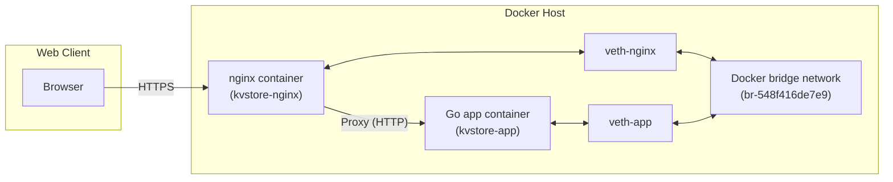
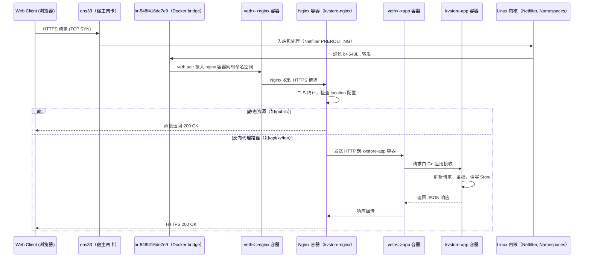

# KVStore Docker 架构拓扑说明

本文件描述 Web 客户端与部署于 Docker Compose 中的 KVStore 系统之间的整体交互结构和请求流程，包括容器拓扑、Nginx 转发、Go 应用服务及 Linux 内核相关模块。

---

## 🧭 网络拓扑结构（Mermaid 图）



说明：

* Web 客户端通过 HTTPS 访问宿主机 IP（如 `https://192.168.16.248`）
* Nginx 接收请求并终止 TLS
* 对静态资源进行本地处理，对 API 请求反向代理到 app 容器
* 所有容器通过 Docker 的默认 bridge 网络 `br-548f416de7e9` 通信

---

## 🧾 请求流程时序图



```shell
kay@kay-vm:chap5$ ip addr show
1: lo: <LOOPBACK,UP,LOWER_UP> mtu 65536 qdisc noqueue state UNKNOWN group default qlen 1000
    link/loopback 00:00:00:00:00:00 brd 00:00:00:00:00:00
    inet 127.0.0.1/8 scope host lo
       valid_lft forever preferred_lft forever
    inet6 ::1/128 scope host
       valid_lft forever preferred_lft forever
2: ens33: <BROADCAST,MULTICAST,UP,LOWER_UP> mtu 1500 qdisc fq_codel state UP group default qlen 1000
    link/ether 00:0c:29:7d:06:3e brd ff:ff:ff:ff:ff:ff
    altname enp2s1
    inet 192.168.16.248/24 brd 192.168.16.255 scope global dynamic noprefixroute ens33
       valid_lft 34193sec preferred_lft 34193sec
    inet6 fd89:5d59:a290::b41/128 scope global dynamic noprefixroute
       valid_lft 12593sec preferred_lft 12593sec
    inet6 fd89:5d59:a290:0:d39c:de79:fe31:6981/64 scope global noprefixroute
       valid_lft forever preferred_lft forever
    inet6 fe80::2941:d378:4cdc:8a6f/64 scope link noprefixroute
       valid_lft forever preferred_lft forever
4: docker0: <NO-CARRIER,BROADCAST,MULTICAST,UP> mtu 1500 qdisc noqueue state DOWN group default
    link/ether 6a:c0:db:d5:f8:a2 brd ff:ff:ff:ff:ff:ff
    inet 172.17.0.1/16 brd 172.17.255.255 scope global docker0
       valid_lft forever preferred_lft forever
    inet6 fe80::68c0:dbff:fed5:f8a2/64 scope link
       valid_lft forever preferred_lft forever
166: br-548f416de7e9: <BROADCAST,MULTICAST,UP,LOWER_UP> mtu 1500 qdisc noqueue state UP group default
    link/ether 46:f7:05:57:d5:1e brd ff:ff:ff:ff:ff:ff
    inet 172.18.0.1/16 brd 172.18.255.255 scope global br-548f416de7e9
       valid_lft forever preferred_lft forever
    inet6 fe80::44f7:5ff:fe57:d51e/64 scope link
       valid_lft forever preferred_lft forever
167: veth620c60d@if2: <BROADCAST,MULTICAST,UP,LOWER_UP> mtu 1500 qdisc noqueue master br-548f416de7e9 state UP group default
    link/ether 2a:69:93:67:aa:97 brd ff:ff:ff:ff:ff:ff link-netnsid 0
    inet6 fe80::2869:93ff:fe67:aa97/64 scope link
       valid_lft forever preferred_lft forever
168: veth76aff30@if2: <BROADCAST,MULTICAST,UP,LOWER_UP> mtu 1500 qdisc noqueue master br-548f416de7e9 state UP group default
    link/ether 7e:a1:ac:21:5d:ec brd ff:ff:ff:ff:ff:ff link-netnsid 1
    inet6 fe80::7ca1:acff:fe21:5dec/64 scope link
       valid_lft forever preferred_lft forever
kay@kay-vm:chap5$
kay@kay-vm:chap5$
kay@kay-vm:chap5$
kay@kay-vm:chap5$ bridge link
167: veth620c60d@ens33: <BROADCAST,MULTICAST,UP,LOWER_UP> mtu 1500 master br-548f416de7e9 state forwarding priority 32 cost 2
168: veth76aff30@ens33: <BROADCAST,MULTICAST,UP,LOWER_UP> mtu 1500 master br-548f416de7e9 state forwarding priority 32 cost 2
kay@kay-vm:chap5$
kay@kay-vm:chap5$
kay@kay-vm:chap5$ bridge vlan
port    vlan ids
docker0  1 PVID Egress Untagged

br-548f416de7e9  1 PVID Egress Untagged

veth620c60d      1 PVID Egress Untagged

veth76aff30      1 PVID Egress Untagged

kay@kay-vm:chap5$
kay@kay-vm:chap5$
kay@kay-vm:chap5$ docker network ls
NETWORK ID     NAME                 DRIVER    SCOPE
39b8c800e230   bridge               bridge    local
548f416de7e9   docker_kvstore_net   bridge    local
069284197a43   host                 host      local
c390748787d6   none                 null      local
kay@kay-vm:chap5$
kay@kay-vm:chap5$ docker ps -s
CONTAINER ID   IMAGE          COMMAND                  CREATED          STATUS                    PORTS                                                                                      NAMES           SIZE
9030fc914e98   docker-nginx   "nginx -g 'daemon of…"   29 minutes ago   Up 29 minutes (healthy)   0.0.0.0:80->80/tcp, [::]:80->80/tcp, 0.0.0.0:443->443/tcp, [::]:443->443/tcp               kvstore-nginx   16.1kB (virtual 143MB)
d23d1312d327   docker-app     "./kvstore --config …"   29 minutes ago   Up 29 minutes (healthy)   0.0.0.0:6060->6060/tcp, [::]:6060->6060/tcp, 0.0.0.0:8080->8080/tcp, [::]:8080->8080/tcp   kvstore-app     32.8kB (virtual 107MB)
kay@kay-vm:chap5$
```

---

## ✳️ 模块说明

### 容器内部模块

| 容器          | 模块/进程              | 说明                                   |
| ----------- | ------------------ | ------------------------------------ |
| nginx       | `nginx.conf`       | 配置 HTTPS、静态资源及反向代理                   |
| kvstore-app | Go 服务器进程           | 接收 `/api/*` 路由，操作内存+BoltDB 存储、处理 TTL |
| 共享网络        | `br-xxxx`, `veth*` | Docker 创建的虚拟交换机和网卡对，用于容器间通信          |

---

### Linux 内核模块参与

| 模块                 | 功能说明                      |
| ------------------ | ------------------------- |
| Netfilter          | PREROUTING/NAT，用于端口转发、包过滤 |
| Network Namespaces | 容器独立网络栈                   |
| veth pair          | 容器间通信链路                   |
| Bridge Driver      | Docker 默认网络，管理容器互通        |
| TLS stack          | 由 Nginx 终止 HTTPS，加密解密处理   |
| syscall 接口         | 应用层请求通过内核 I/O 调用执行        |

---

## 🕵️ 如何查找容器的 veth 接口

以 `kvstore-app` 为例：

### 步骤 1：获取容器的 PID

```bash
docker inspect -f '{{.State.Pid}}' kvstore-app
```

输出：
```bash
kay@kay-vm:chap5$ docker inspect -f '{{.State.Pid}}' kvstore-app
158761
kay@kay-vm:chap5$ 
```

### 步骤 2：进入容器 network namespace 查看接口

```bash
sudo nsenter -t 158761 -n ip link
```

输出：
```bash
kay@kay-vm:chap5$ sudo nsenter -t 158761 -n ip link
1: lo: <LOOPBACK,UP,LOWER_UP> mtu 65536 qdisc noqueue state UNKNOWN mode DEFAULT group default qlen 1000
    link/loopback 00:00:00:00:00:00 brd 00:00:00:00:00:00
2: eth0@if167: <BROADCAST,MULTICAST,UP,LOWER_UP> mtu 1500 qdisc noqueue state UP mode DEFAULT group default
    link/ether f6:2c:b3:37:21:fd brd ff:ff:ff:ff:ff:ff link-netnsid 0
kay@kay-vm:chap5$
```

其中 `eth0@if167` 表明对应宿主机接口编号为 167

### 步骤 3：在宿主机上查找 veth 接口名

```bash
sudo ip link | grep "167"
```

输出：
```
kay@kay-vm:chap5$ sudo ip link | grep "167"
167: veth620c60d@if2: <BROADCAST,MULTICAST,UP,LOWER_UP> mtu 1500 qdisc noqueue master br-548f416de7e9 state UP mode DEFAULT group default
kay@kay-vm:chap5$
```

即：`kvstore-app` 容器的 `eth0` 对应的宿主机接口为 `veth620c60d@if2`

---

如需进一步追踪网络包流向，可使用：

```bash
sudo tcpdump -i veth620c60d
```

或查看 bridge：

```bash
brctl show
```
或
```bash
bridge link
```

---


## 查看容器网络信息命令

### 快速查看所有运行容器及其加入的网络 (IP 地址)

```bash
docker inspect -f '{{.Name}} -> {{range $k,$v := .NetworkSettings.Networks}}{{$k}} (IP: {{$v.IPAddress}}) {{end}}' $(docker ps -q)
```

输出示例：

```
/kvstore-nginx -> docker_kvstore_net (IP: 172.18.0.3)
/kvstore-app -> docker_kvstore_net (IP: 172.18.0.2)
```

### 查看某个容器的网络详细配置

```bash
docker inspect -f '{{json .NetworkSettings.Networks}}' kvstore-app | python3 -m json.tool
```

输出：

```json
{
    "docker_kvstore_net": {
        "IPAMConfig": null,
        "Links": null,
        "Aliases": [
            "kvstore-app",
            "app"
        ],
        "MacAddress": "f6:2c:b3:37:21:fd",
        "DriverOpts": null,
        "GwPriority": 0,
        "NetworkID": "548f416de7e928b5d4c6f6e6b1ef81e5ab517c77b901387084031dc43695badd",
        "EndpointID": "b6ccd4b55cb6a81aa07557c081b50e8100fbf1ff7317ae7b85a58a0392e9d659",
        "Gateway": "172.18.0.1",
        "IPAddress": "172.18.0.2",
        "IPPrefixLen": 16,
        "IPv6Gateway": "",
        "GlobalIPv6Address": "",
        "GlobalIPv6PrefixLen": 0,
        "DNSNames": [
            "kvstore-app",
            "app",
            "d23d1312d327"
        ]
    }
}
```