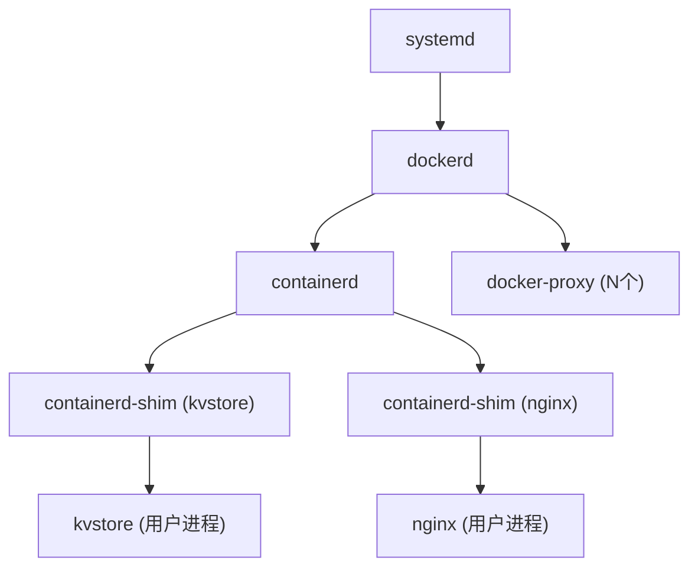

---

## 从 `pstree -s` 看容器架构与进程关系

通过 `pstree -s` 命令观察主机上运行容器时的进程树，可以深入理解 Docker、containerd 与容器进程之间的关系。以下是命令输出与解释分析。

---

## 🖥️ 示例命令输出

```bash
kay@kay-vm:book_cloud_naive_go$ pstree -s
systemd─┬─...
        ├─containerd───10*[{containerd}]
        ├─containerd-shim─┬─kvstore───6*[{kvstore}]
        │                 └─11*[{containerd-shim}]
        ├─containerd-shim─┬─nginx───2*[nginx]
        │                 └─11*[{containerd-shim}]
        ├─dockerd─┬─docker-proxy───[{docker-proxy}]
        │         └─20*[{dockerd}]
````

---

## 🧱 主要组件说明

* **systemd**
  Linux 系统的初始化进程，负责启动用户空间服务，包括容器守护进程。

* **dockerd**（Docker Daemon）
  Docker 的主守护进程，负责管理镜像、网络、卷和调用 containerd 启动容器。

* **containerd**
  Docker 使用的容器运行时，负责管理容器的生命周期。

* **containerd-shim**
  每个容器会启动一个对应的 shim 进程，它的职责包括：

  * 独立维护容器主进程的生命周期，即使 containerd 或 dockerd 崩溃，容器仍可运行；
  * 捕获容器进程的 stdout/stderr；
  * 避免 containerd 与容器主进程直接通信，实现解耦。

* 🔍 **shim 的字面含义**：
  “Shim” 原意是“垫片”或“垫块”，在计算机系统中常用作中间层，用于兼容或桥接两个系统模块。在容器中，`containerd-shim` 就是连接 `containerd` 与容器主进程的中间代理层。

* **容器进程（如 kvstore, nginx）**
  容器内运行的主应用进程，由 containerd-shim 启动并管理。

* **docker-proxy**
  为容器配置端口映射（如 -p 8080:80）时生成的用户态代理进程。监听主机端口并转发至容器。

---

## 🧩 容器运行流程概览



---

## ✅ 总结

通过 `pstree -s` 可以观察容器启动后：

1. 容器主进程不是直接由 dockerd/containerd 启动，而是由 `containerd-shim` 启动； 
2. 每个容器有独立的 shim，确保其与 Docker 守护进程解耦；
3. `docker-proxy` 实现了宿主与容器的端口转发，通常在使用 `-p` 映射端口时出现。
4. 该模型有助于提高容器稳定性，即使 Docker 守护进程挂掉，容器仍可持续运行。
5. 每个容器都通过一个独立的 `containerd-shim` 运行，shim 保证了容器与 containerd 解耦。
6. `dockerd` 与 `containerd` 之间通过 RPC 协议通信，容器生命周期由 containerd 控制。
7. `pstree -s` 是一种直观的方式来理解容器进程结构与宿主系统的关系，适用于排障与学习。
---

